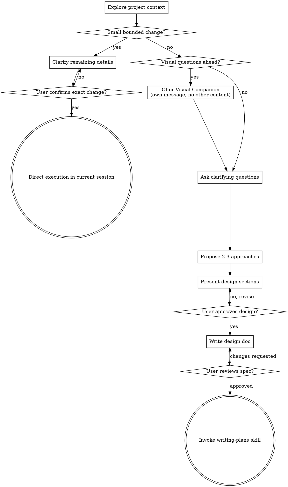

# Brainstorming Ideas Into Designs

Help turn ideas into fully formed designs and specs through natural collaborative dialogue.

Start by understanding the current project context, then ask questions one at a time to refine the idea. Once you understand what you're building, present the design and get user approval.

<HARD-GATE>
Do NOT invoke any implementation skill, write any code, scaffold any project, or take any implementation action until you have either:
1. presented a design and the user has approved it, or
2. confirmed that the task qualifies for the small bounded change exception below.

**Small bounded change exception:** After exploring the current project context, you may execute directly in the current session when the analyzed modification scope is narrow, localized, and explicit enough to summarize precisely, and the user confirms that exact change. Judge this by the analyzed change boundary — not by file type. A change to code, docs, skills, or config can all qualify if the scope is truly small and bounded.

When using this exception:
- do NOT write spec or plan files
- do NOT hand off to `/run-plan`
- do NOT create task branches just for the change
- keep the change minimal and verify it before claiming success
</HARD-GATE>

## Anti-Pattern: "This Is Too Simple To Need Any Analysis"

Do not skip context reading and clarification just because a request sounds small. Most behavior changes should still follow the full design → spec → plan flow. The exception is only for changes whose scope is proven to be small and bounded after analysis, not for work that merely sounds simple at first glance.

## Checklist

You MUST create a task for each applicable item and complete them in order:

1. **Explore project context** — check files, docs, recent commits
2. **Assess whether the small bounded change exception applies** — decide based on analyzed scope, not file type
3. **If yes: clarify and confirm exact change** — once confirmed, implement directly in the current session
4. **If no: offer visual companion** (if topic will involve visual questions) — this is its own message, not combined with a clarifying question. See the Visual Companion section below.
5. **Ask clarifying questions** — one at a time, understand purpose/constraints/success criteria
6. **Propose 2-3 approaches** — with trade-offs and your recommendation
7. **Present design** — in sections scaled to their complexity, get user approval after each section
8. **Write design doc** — save to `docs/superpowers/specs/YYYY-MM-DD-<topic>-design.md` and commit
9. **User reviews written spec** — ask user to review the spec file before proceeding
10. **Transition to implementation** — invoke writing-plans skill to create implementation plan

## Process Flow

**Terminal states:** For small bounded changes, stop at direct execution in the current session. Otherwise the terminal state is invoking writing-plans. Do NOT invoke frontend-design, mcp-builder, or any other implementation skill. The ONLY skill you invoke after the full brainstorming path is writing-plans.

## The Process

**Understanding the idea:**

- Check out the current project state first (files, docs, recent commits)
- After context reading, decide whether the request qualifies as a small bounded modification: narrow scope, localized impact, no new architecture or workflow, and explicit enough to summarize precisely. Judge this by analyzed scope, not by whether the target is code, docs, skills, or config.
- If it qualifies, ask only the minimum clarification needed, get explicit confirmation, and then implement directly in the current session without spec/plan files, `/run-plan` handoff, or task branches.
- Before asking detailed questions for larger work, assess scope: if the request describes multiple independent subsystems (e.g., "build a platform with chat, file storage, billing, and analytics"), flag this immediately. Don't spend questions refining details of a project that needs to be decomposed first.
- If the project is too large for a single spec, help the user decompose into sub-projects: what are the independent pieces, how do they relate, what order should they be built? Then brainstorm the first sub-project through the normal design flow. Each sub-project gets its own spec → plan → implementation cycle.
- For appropriately-scoped projects that do not qualify for the small bounded change exception, ask questions one at a time to refine the idea
- Prefer multiple choice questions when possible, but open-ended is fine too
- Only one question per message - if a topic needs more exploration, break it into multiple questions
- Focus on understanding: purpose, constraints, success criteria

**Exploring approaches:**

- Propose 2-3 different approaches with trade-offs
- Present options conversationally with your recommendation and reasoning
- Lead with your recommended option and explain why

**Presenting the design:**

- Once you believe you understand what you're building, present the design
- Scale each section to its complexity: a few sentences if straightforward, up to 200-300 words if nuanced
- Ask after each section whether it looks right so far
- Cover: architecture, components, data flow, error handling, testing
- Be ready to go back and clarify if something doesn't make sense

**Design for isolation and clarity:**

- Break the system into smaller units that each have one clear purpose, communicate through well-defined interfaces, and can be understood and tested independently
- For each unit, you should be able to answer: what does it do, how do you use it, and what does it depend on?
- Can someone understand what a unit does without reading its internals? Can you change the internals without breaking consumers? If not, the boundaries need work.
- Smaller, well-bounded units are also easier for you to work with - you reason better about code you can hold in context at once, and your edits are more reliable when files are focused. When a file grows large, that's often a signal that it's doing too much.

**Working in existing codebases:**

- Explore the current structure before proposing changes. Follow existing patterns.
- Where existing code has problems that affect the work (e.g., a file that's grown too large, unclear boundaries, tangled responsibilities), include targeted improvements as part of the design - the way a good developer improves code they're working in.
- Don't propose unrelated refactoring. Stay focused on what serves the current goal.

## After the Design

**Documentation:**

- Write the validated design (spec) to `docs/superpowers/specs/YYYY-MM-DD-<topic>-design.md`
  - (User preferences for spec location override this default)
- Treat `docs/superpowers/...` as the working area for design/plan artifacts unless the project already defines a better location
- Durable architecture / design / rules discovered during the work must later be promoted into the project's long-lived documentation structure instead of living only in `docs/superpowers/...`
- Use elements-of-style:writing-clearly-and-concisely skill if available
- Commit the design document to git

**User Review Gate:**
After writing the spec document, ask the user to review the written spec before proceeding:

> "Spec written and committed to `<path>`. Please review it and let me know if you want to make any changes before we start writing out the implementation plan."

Wait for the user's response. If they request changes, make them and update the spec file. Only proceed once the user approves.

**Implementation:**

- If the task followed the full design path, invoke the writing-plans skill to create a detailed implementation plan
- If the task qualified for the small bounded change exception and the user confirmed the exact change, execute it directly in the current session
- For the exception path, do NOT create spec/plan files, do NOT hand off to `/run-plan`, and do NOT create task branches just for the change
- Do NOT invoke any other implementation skill. On the full design path, writing-plans is the next step.

## Key Principles

- **One question at a time** - Don't overwhelm with multiple questions
- **Multiple choice preferred** - Easier to answer than open-ended when possible
- **YAGNI ruthlessly** - Remove unnecessary features from all designs
- **Explore alternatives** - Always propose 2-3 approaches before settling
- **Incremental validation** - Present design, get approval before moving on
- **Be flexible** - Go back and clarify when something doesn't make sense

## Visual Companion

A browser-based companion for showing mockups, diagrams, and visual options during brainstorming. Available as a tool — not a mode. Accepting the companion means it's available for questions that benefit from visual treatment; it does NOT mean every question goes through the browser.

**Offering the companion:** When you anticipate that upcoming questions will involve visual content (mockups, layouts, diagrams), offer it once for consent:
> "Some of what we're working on might be easier to explain if I can show it to you in a web browser. I can put together mockups, diagrams, comparisons, and other visuals as we go. This feature is still new and can be token-intensive. Want to try it? (Requires opening a local URL)"

**This offer MUST be its own message.** Do not combine it with clarifying questions, context summaries, or any other content. The message should contain ONLY the offer above and nothing else. Wait for the user's response before continuing. If they decline, proceed with text-only brainstorming.

**Per-question decision:** Even after the user accepts, decide FOR EACH QUESTION whether to use the browser or the terminal. The test: **would the user understand this better by seeing it than reading it?**

- **Use the browser** for content that IS visual — mockups, wireframes, layout comparisons, architecture diagrams, side-by-side visual designs
- **Use the terminal** for content that is text — requirements questions, conceptual choices, tradeoff lists, A/B/C/D text options, scope decisions

A question about a UI topic is not automatically a visual question. "What does personality mean in this context?" is a conceptual question — use the terminal. "Which wizard layout works better?" is a visual question — use the browser.

If they agree to the companion, read the detailed guide before proceeding:
`skills/brainstorming/visual-companion.md`
